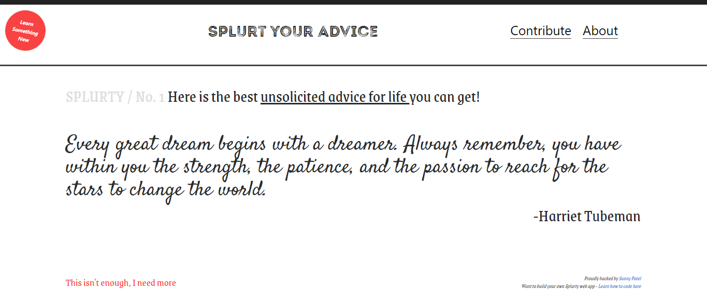

# Splurty

It is a quote generating app which randomly shows quotes stored in database. It also has a feature for user to enter a quote.

## [Try it yourself](https://splurty-sunny-patel.herokuapp.com/) 

### Prerequisites

You will need to setup Vagrant environment to run the application on local machine. To find the installation instructions for your OS, visit :

```
https://github.com/FirehoseProject/firehose-vagrant-rails5
```
### Installing

Initiate the vagrant environment.

Git clone the repository to your local machine in the src folder :

HTTPS:
```
$ git clone https://github.com/spp1991/Splurty.git
```

SSH:

```
$ git clone git@github.com:spp1991/Splurty.git
```

Open application folder created by git clone command:

```
$ cd Splurty
```

Install all the gems used in application:

```
$ bundle install
```

Install the application database and create all the tables:

```
$ rails db:create
$ rails db:migrate
```

You will then be able to start the app locally by runnning:

```
$ rails server -b 0.0.0.0 -p 3000
```

## Built With

* [Ruby on Rails](https://rubyonrails.org/) - Web framework
* [PostgreSQL](https://www.postgresql.org/) - Database
* [HTML5](https://en.wikipedia.org/wiki/HTML5) - Web markup language
* [CSS3](http://www.css3.info/) - Webpage Style Sheet language
* [Bootstrap](https://getbootstrap.com/) - CSS Framework
* [Javascript](https://www.javascript.com/) - Web Programming language
* [jQuery](https://jquery.com/) - Javascript Framework
* [Amazon Web Service](https://aws.amazon.com/) - Cloud Storage Platform
* [Simple-form](https://github.com/heartcombo/simple_form) - Ruby gems

## Home Page

